<!-- ═══════════════════════════════════════════════════════════════════ -->
<!-- AI RESEARCH OS — github.com/DevChiniwala                          -->
<!-- ═══════════════════════════════════════════════════════════════════ -->

<div align="center">

<a href="https://github.com/DevChiniwala">
<picture>
  <source media="(prefers-color-scheme: dark)" srcset="./assets/hero.svg"/>
  <source media="(prefers-color-scheme: light)" srcset="./assets/hero.svg"/>
  
</picture>
</a>

<br/>

<!-- Typing SVG -->
<a href="https://github.com/DevChiniwala">
  
</a>

<br/>

<!-- Profile Badges -->

&nbsp;&nbsp;

&nbsp;&nbsp;


</div>


<!-- ═══════════ 01 · FLAGSHIP SYSTEMS ═══════════ -->

<div align="center">

<a href="https://github.com/DevChiniwala/HeyClara">
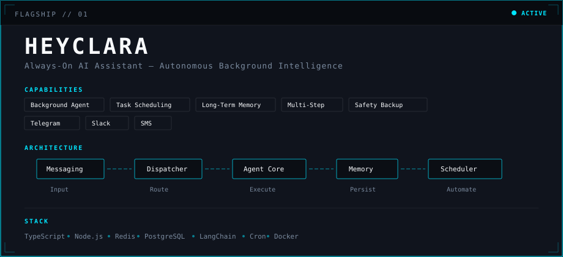
</a>

<br/><br/>

<a href="https://github.com/DevChiniwala/AegisOS">
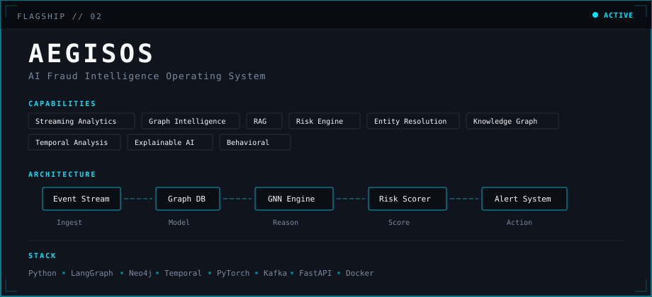
</a>

<br/><br/>

<a href="https://github.com/DevChiniwala/CortexOS">
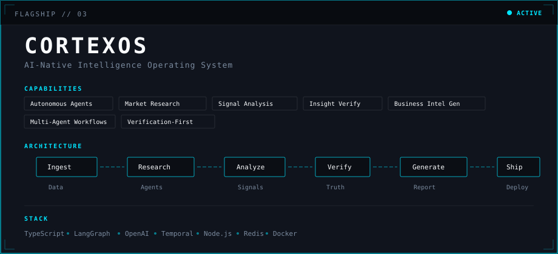
</a>

</div>

<br/>

<div align="center">
<table>
<tr>
<td align="center"><a href="https://github.com/DevChiniwala/ShopSageAI">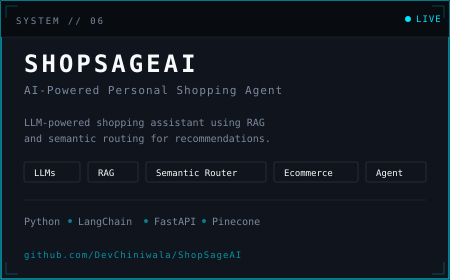</a></td>
<td align="center">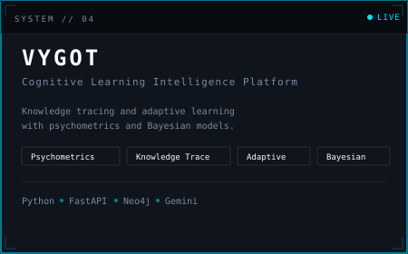</td>
</tr>
<tr>
<td align="center" colspan="2"><a href="https://github.com/DevChiniwala/-PagePilot">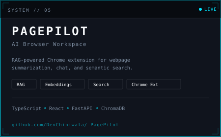</a></td>
</tr>
</table>
</div>


<!-- ═══════════ 02 · RESEARCH DOMAINS ═══════════ -->

<div align="center">
<a href="https://github.com/DevChiniwala?tab=repositories">
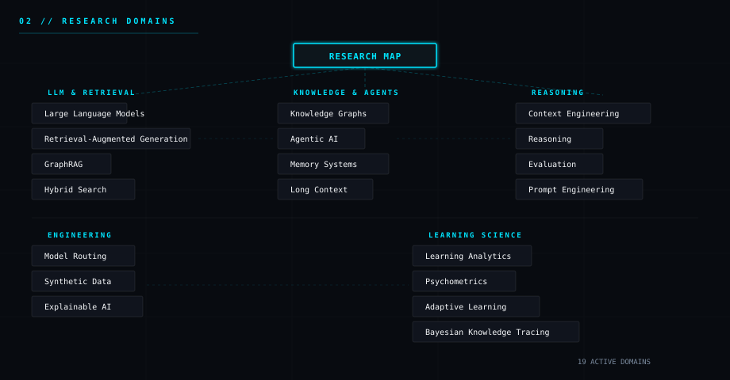
</a>
</div>


<!-- ═══════════ 03 · SYSTEM STACK ═══════════ -->

<div align="center">
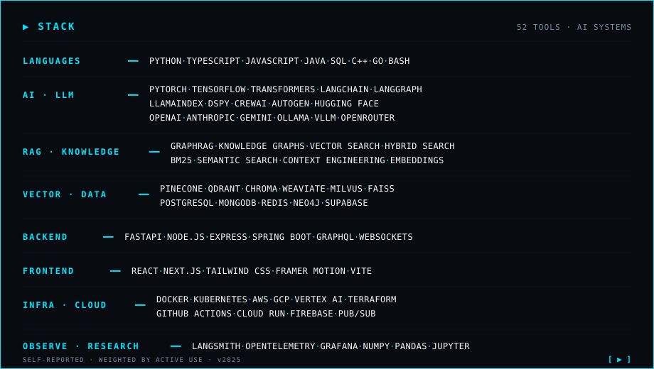
</div>


<!-- ═══════════ 04 · RESEARCH TELEMETRY ═══════════ -->

<div align="center">
<a href="https://github.com/DevChiniwala?tab=repositories">
</a>
</div>


<!-- ═══════════ 05 · SYSTEM ARCHITECTURE ═══════════ -->

<div align="center">
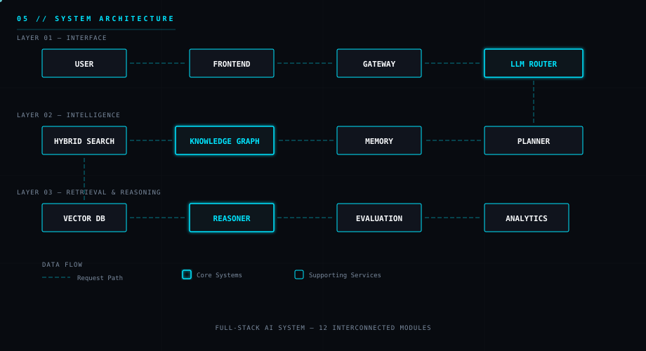
</div>


<!-- ═══════════ 06 · CURRENT RESEARCH ═══════════ -->

<div align="center">
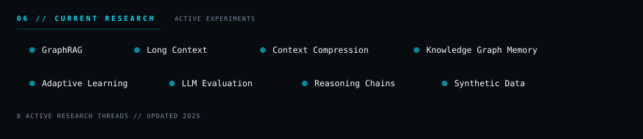
</div>


<!-- ═══════════ 07 · ROADMAP ═══════════ -->

<div align="center">
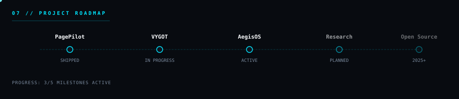
</div>


<!-- ═══════════ 08 · PHILOSOPHY ═══════════ -->

<div align="center">
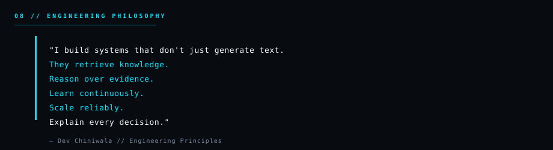
</div>


<!-- ═══════════ DOCTRINE ═══════════ -->

<div align="center">

```
┌─────────────────────────────────────────────────────────────┐
│  DOCTRINE                                                    │
│                                                              │
│  01 — Agents need memory, not just prompts                   │
│  02 — Context is the new fine-tuning                         │
│  03 — Every system must explain its reasoning                │
│  04 — Retrieval beats generation when truth matters          │
│  05 — Ship production systems, not demos                     │
└─────────────────────────────────────────────────────────────┘
```

</div>


<!-- ═══════════ 09 · GITHUB ANALYTICS ═══════════ -->

<div align="center">

<a href="https://github.com/DevChiniwala">
  
</a>
<a href="https://github.com/DevChiniwala">
  
</a>

<br/><br/>

<a href="https://github.com/DevChiniwala">
  
</a>

</div>


<!-- ═══════════ 10 · CONNECT ═══════════ -->

<div align="center">

```
> ESTABLISHING CONNECTION...
```

```bash
  npx devcard0707
```

<br/>

<a href="https://www.linkedin.com/in/dev-chiniwala/"><code>LinkedIn</code></a> ·
<a href="https://x.com/DevChiniwala"><code>X / Twitter</code></a> ·
<a href="mailto:dev.chiniwala@gmail.com"><code>Email</code></a> ·
<a href="https://github.com/DevChiniwala"><code>GitHub</code></a>

</div>


<!-- ═══════════ CONTRIBUTION SNAKE ═══════════ -->

<div align="center">
<picture>
  <source media="(prefers-color-scheme: dark)" srcset="https://raw.githubusercontent.com/DevChiniwala/DevChiniwala/output/github-snake-dark.svg"/>
  <source media="(prefers-color-scheme: light)" srcset="https://raw.githubusercontent.com/DevChiniwala/DevChiniwala/output/github-snake.svg"/>
  
</picture>
</div>

<br/>

<!-- FOOTER -->

